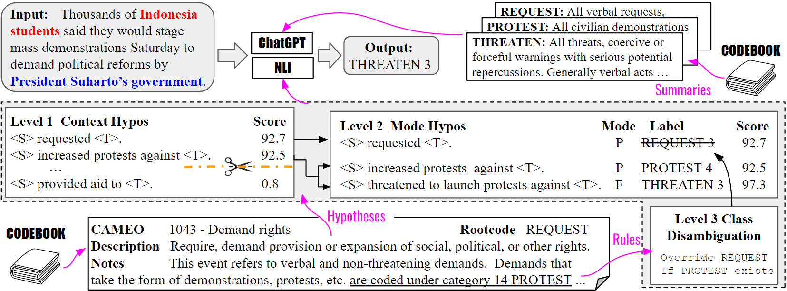

# zero-shot-PLOVER (ZSP)

This repository contains the essential code and data for the paper [Synthesizing Political Zero-Shot Relation Classification via Codebook Knowledge, NLI, and ChatGPT](https://arxiv.org/pdf/2308.07876v2.pdf). 

ZSP is a modality-aware tree-query framework based on natural language inference (NLI) to solve relation classification for PLOVER ontology.
The goal is to offer political scientists a pragmatic solution beyond mere dataset annotation for black-box supervised models, providing a practical alternative that taps into existing knowledge and codebook resources.

## Structure
- codebooks:     CAMEO and PLOVER ontology codebooks
- datasets:   PLV and AW datasets.
- prompts:  Hypothesis designed from the codebooks.
- scores: saved NLI scores for reproduction.
- main_script.py:  Our main python script file.
- utils.py:   utility functions
- demo.ipynb:      a demo Colab notebook that loads our saved query result.

## Quick Start

- Click the Colab demo to see the figures and report shown in the paper: 

- Offline inference using a saved checkpoint of NLI scores. No GPU computation is required.

      export DATASET=PLV_test; \
      PROMPT=Tree; \
      CUDA_VISIBLE_DEVICES=0 \
      python main_script.py \
      --data_dir ./datasets/${DATASET}.tsv \
      --prompt_dir ./prompts/${PROMPT}.txt  \
      --score_dir ./scores/${DATASET}-${PROMPT}.npy \
      --model_name roberta-large-mnli \
      --output_dir ./outputs/${DATASET}-${PROMPT}-result.csv \
      --consult_penalty 0.02 \
      --infer_setting offline \
      --run_offline_nli False \
      --write_score_result False \
      --infer_details True \
      --summary_details True

- Offline inference : Run NLI for all prompts from scratch on GPUs => NLI scores => offline inference. 
This might take longer than Online inference, but it can save the NLI scores file for fast reproduction and parameter study.
      
      export DATASET=PLV_test; \
      PROMPT=Tree; \
      CUDA_VISIBLE_DEVICES=0 \
      python main_script.py \
      --data_dir ./datasets/${DATASET}.tsv \
      --prompt_dir ./prompts/${PROMPT}.txt  \
      --score_dir ./scores/${DATASET}-${PROMPT}.npy \
      --model_name roberta-large-mnli \
      --output_dir ./outputs/${DATASET}-${PROMPT}-result.csv \
      --consult_penalty 0.02 \
      --infer_setting offline \
      --run_offline_nli True \
      --write_score_result True \
      --infer_details True \
      --summary_details True

- Online inference: Run NLI scores for tree prompts on GPUs and do inference simutaneously. 
      
      export DATASET=PLV_test; \
      PROMPT=Tree; \
      CUDA_VISIBLE_DEVICES=0 \
      python main_script.py \
      --data_dir ./datasets/${DATASET}.tsv \
      --prompt_dir ./prompts/${PROMPT}.txt  \
      --score_dir ./scores/${DATASET}-${PROMPT}.npy \
      --model_name roberta-large-mnli \
      --output_dir ./outputs/${DATASET}-${PROMPT}-result.csv \
      --consult_penalty 0.02 \
      --infer_setting online \
      --infer_details True \
      --summary_details True

## Citation

If you find this repo useful in your research, please consider citing:

      @misc{hu2023synthesizing,
            title={Synthesizing Political Zero-Shot Relation Classification via Codebook Knowledge, NLI, and ChatGPT}, 
            author={Yibo Hu and Erick Skorupa Parolin and Latifur Khan and Patrick T. Brandt and Javier Osorio and Vito J. D'Orazio},
            year={2023},
            eprint={2308.07876},
            archivePrefix={arXiv},
            primaryClass={cs.CL}
      }

